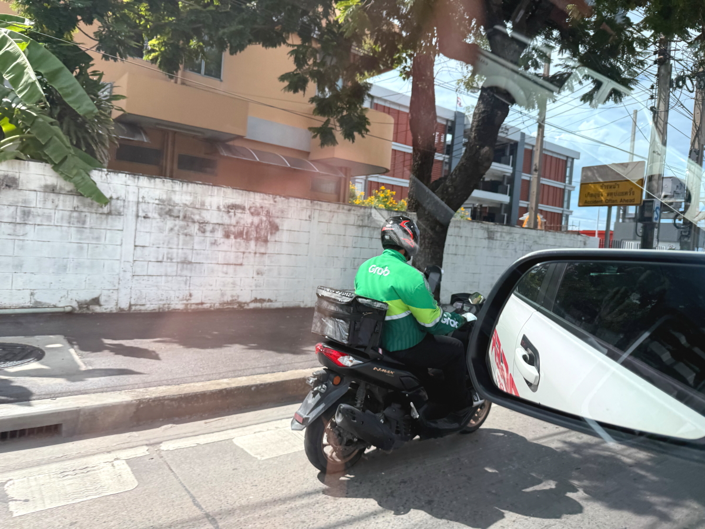
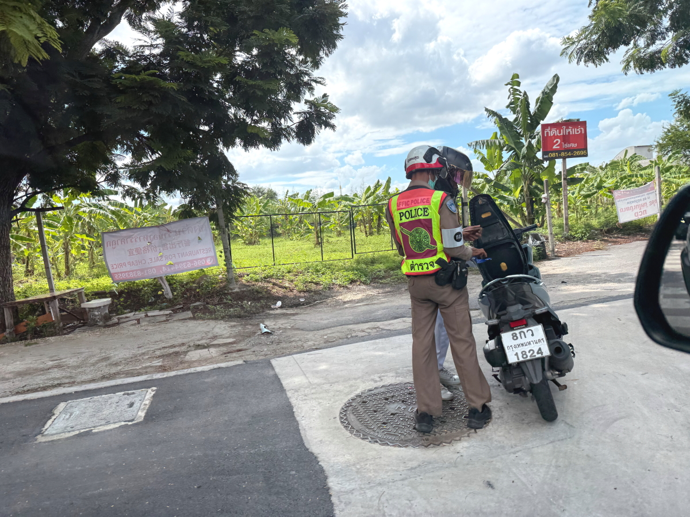
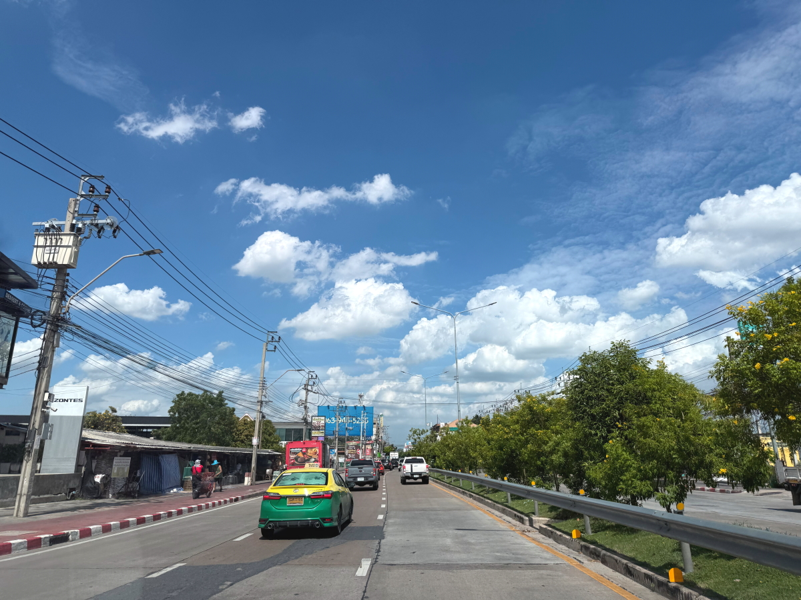

# 20250829_bangkok

<html lang="ja" data-loaded="false" data-scrolled="false" data-spmenu="closed">
<head>

<meta charset="UTF-8">
<meta http-equiv="Content-Type" content="text/html; charset=UTF-8">
<meta http-equiv="X-UA-Compatible" content="IE=EmulateIE10" />
<meta http-equiv="X-UA-Compatible" content="IE=edge">

<meta name="viewport" content="width=device-width, initial-scale=1.0">

<!--ここから上はお決まりの定型文です-->

<!--ここからが表現の書式などを決めるcssという部分-->

<link href="https://cdnjs.cloudflare.com/ajax/libs/lightbox2/2.7.1/css/lightbox.css" rel="stylesheet">

</head>

<body>

モバイル端末をお使いの場合は、画面を横向きにすると
背景画像の横方向がご覧頂けます。

<!--ここ上は、ほぼそのまま使います！-->

<!--QRコードの挿入例-->

 アクセス用QRコード

<marquee direction="left" scrollamount="20" width="30%">(^_^)/~alis</marquee>

<!--流れ文字の挿入例-->
<h1><marquee behavior="left">!!! 2025/08/27-29、午後の怪しい雲行きから、公園の仏壇まで!!!</marquee></h1>

                          

<!--ここから下が、本体部分-->
    

 
<h2>27日、曇り空の下ですが、バンコク市街に移動します</h2>

    
<h2>モノレール駅の近く、そこそこ大きなショッピングモールに向かいます</h2>

    
<h2>地下一階の全体が雑貨コーナー</h2>

    
<h2>2Fに移動すると金融エリア</h2>

    
<h2>各国通貨の両替レート一覧、円はかなり安め</h2>

    
<h2>大金が動くので警備は厳重</h2>

    
<h2>銀行の順番は右上の電光掲示板の番号札で管理</h2>

    
<h2>中央広場ではイベント待ちのお客さんが待機</h2>

    
<h2>携帯やIT機器の中古品販売コーナー</h2>

    
<h2>絵本コーナーで女の子がおおはしゃぎ</h2>

    
<h2>お花屋さんのお花も鮮やかです</h2>

    
<h2>お花屋さんの店主はスマホ見るのに忙しそう</h2>

    
<h2>フードコート横の食料品コーナーでお昼を調達</h2>

    
<h2>27日の遅いお昼はこれ</h2>

    
<h2>王室直営店で明日のパンなど調達</h2>

    
<h2>中央広場でイベントがスタートしてました</h2>

    
<h2>敷地の外側、北西の一角には仏壇がお供えされています</h2>

    
<h2>仏壇の背景はモノレールの駅と高層ビル</h2>

    
<h2>9バーツで乗れる市内移動の乗合トラック</h2>

    
<h2>歩道が工事中で車道を歩くお姉様</h2>

    
<h2>バイクの多人数乗車は当たり前</h2>

    
<h2>28日、熱帯のお花は朝から満開</h2>

    
<h2>朝の青空も、お昼すぎには一面の曇り空に</h2>

    
<h2>市内の高い建物の上にセルラー通信のアンテナが建つのは日本と同じ</h2>

    
<h2>バイク屋さんは忙しそうです</h2>

    
<h2>2日続けて市内のショッピングモール</h2>

    
<h2>中央広場につながる階段の電装が見事</h2>

    
<h2>バーツ・円の換算レートは円安で安定</h2>

    
<h2>飲み物の販売コーナー、冷たいコーヒーは５バーツ値上がり</h2>

    
<h2>ロボットのおもちゃはセール価格中</h2>

    
<h2>保冷用の水筒がカラフルです</h2>

    
<h2>イベント広場は次のイベントに向けてスタッフが集まりました</h2>

    
<h2>この日は地下に降りずに1Fのお店でお昼ご飯</h2>

    
<h2>イスラム系のレジのお姉さん</h2>

    
<h2>バーツ・円の換算レートは、円安で完全に安定</h2>

    
<h2>八百屋さんのバナナの切り売りが圧巻です</h2>

    
<h2>帰り道、青空が覗き始めました</h2>

    
<h2>フードデリバリーのバイクはNo無し</h2>

    
<h2>一般のバイクが何か違反したようです</h2>

    
<h2>バンコク市街に広がる熱帯の青空</h2>

    
<h2>放し飼いのタイの犬が食べ物ねだりに来たので、コンビニで買った犬の餌をあげます</h2>

    
<h2>住宅街の立木に夕陽が当たって映えました</h2>

    
<h2>夕焼け空は残念ながら曇り空</h2>

    
<h2>29日、公園の仏壇は綺麗に祀られています</h2>

         

<!--  
<h2>再掲【暑中お見舞い（ほたる）】LINEでご挨拶・動画で送る夏のグリーティングカード / ギターbgm/蛍の光・癒し動画</h2>

<iframe width="560" height="315" src="https://www.youtube.com/embed/Z4PKDOhRzfI?si=LaAJ8dA-1izGspEO" title="YouTube video player" frameborder="0" allow="accelerometer; autoplay; clipboard-write; encrypted-media; gyroscope; picture-in-picture; web-share" referrerpolicy="strict-origin-when-cross-origin" allowfullscreen></iframe>
    
   
-->   
    
    

  
<h2>今日のBGMは Eric Clapton, Rod Stewart, Michael Bolton, Elton John, Bee Gees 🎙 The Legends Soft Rock 70s 80s</h2>

<iframe width="560" height="315" src="https://www.youtube.com/embed/cfIweRPXC2U?si=DJeqWCuybdut_5D9" title="YouTube video player" frameborder="0" allow="accelerometer; autoplay; clipboard-write; encrypted-media; gyroscope; picture-in-picture; web-share" referrerpolicy="strict-origin-when-cross-origin" allowfullscreen></iframe>
    

    
  
<h2>8月27日にメタバースで披露されたまいてゃさんの新曲「Lonely game」</h2>

<iframe width="560" height="315" src="https://www.youtube.com/embed/HstFJ2_8oQA?si=QrYNv_EcIm7fALkV" title="YouTube video player" frameborder="0" allow="accelerometer; autoplay; clipboard-write; encrypted-media; gyroscope; picture-in-picture; web-share" referrerpolicy="strict-origin-when-cross-origin" allowfullscreen></iframe>
    

    
    

    
    
    <h3>「雪の中で輝くシンデレラ」by まいてゃ</h3>
<h2><a href="https://torokoid.github.io/20250219_chiangrai/maitiyaz.mp3" target="_blank">この文字クリックで再生します 下の再生ボタンでも同じ曲をループ再生します</a></h2>

    <audio controls loop>
        <source src="https://torokoid.github.io/20250219_chiangrai/maitiyaz.mp3" type="audio/mpeg">
        お使いのブラウザは audio タグをサポートしていません。
    </audio>
 
    
<!--
  
<h2>スティーブ・ジョブズの伝説の講義</h2> 
<iframe width="560" height="315" src="https://www.youtube.com/embed/XsRpvWHIVw0?si=f7IA0pv9iZWVk3VH" title="YouTube video player" frameborder="0" allow="accelerometer; autoplay; clipboard-write; encrypted-media; gyroscope; picture-in-picture; web-share" referrerpolicy="strict-origin-when-cross-origin" allowfullscreen></iframe>    
    
    
<h2>スティーブ・ジョブズ氏の講義の内容が「笑って死ぬ」by まいてゃ さんの歌の内容と大筋で同じに聞こえます 以下に再掲しますね</h2>

    
<h3>歌の後半部分しか撮れてませんが、2月16日のイベントで公開された「笑って死ぬ」 by まいてゃ 白ドレスはダンサーの玖遠さん、黒いドレスがまいてゃさん</h3>
<iframe width="560" height="315" src="https://www.youtube.com/embed/s4ZcbxAluMM?si=Xa32xo19UCNaWv0v" title="YouTube video player" frameborder="0" allow="accelerometer; autoplay; clipboard-write; encrypted-media; gyroscope; picture-in-picture; web-share" referrerpolicy="strict-origin-when-cross-origin" allowfullscreen></iframe> 
-->
    

    <h3>お気に入りの「笑って死ぬ」 by まいてゃさんも再々掲です</h3>
<h2><a href="https://torokoid.github.io/20250221_chiangrai/maitiya3.mp3" target="_blank">この文字クリックで再生します 下の再生ボタンで同じ曲をループ再生します</a></h2>

    <audio controls loop>
        <source src="https://torokoid.github.io/20250221_chiangrai/maitiya3.mp3" type="audio/mpeg">
        お使いのブラウザは audio タグをサポートしていません。
    </audio>

   
<h2>以上、午後の怪しい雲行きから、公園の仏壇まででした。 ここまでご覧いただきありがとうございました。</h2>

     
<h2>
<a href="https://torokoid.github.io/Mashiko_himawari_3/" target="_blank">クリックでメニューページに戻ります</a>
</h2>

   

<!-- hitwebcounter Code START -->
<a href="https://www.hitwebcounter.com" target="_blank">

あなたは 番目の訪問者です 数値は8月1日以降に立ち上げたバンコクシリーズHPの累計です
</a>   

         

  

      

<!--本体はここまで-->

<!--画面に空白地帯を作って、背景が見えるようにしています-->
                                              

<!-- フッタ -->
<footer>

Copyright 2025/08/29 alis @Bangkok

</footer>

<!--HPにさまざまなJavaScriptを呼び込むための書式-->

    
    </body>
    
</html>
